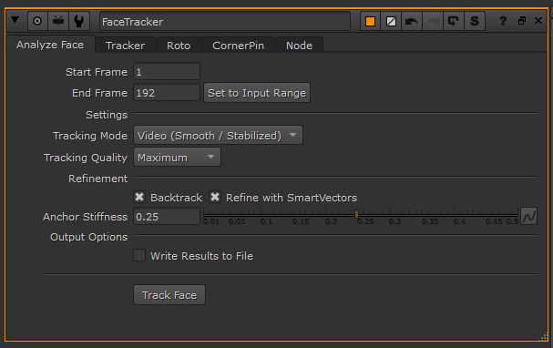
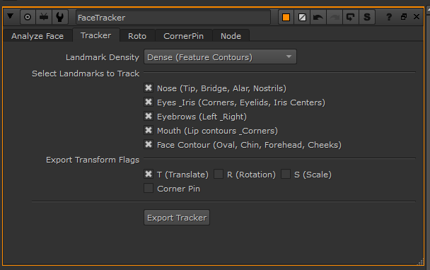
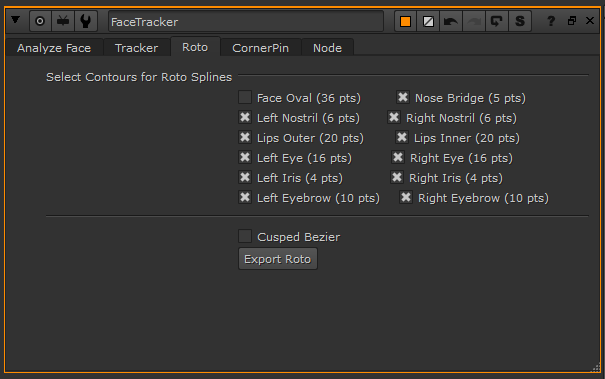
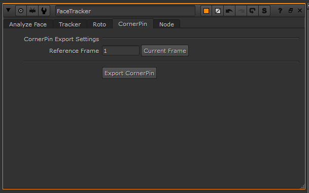
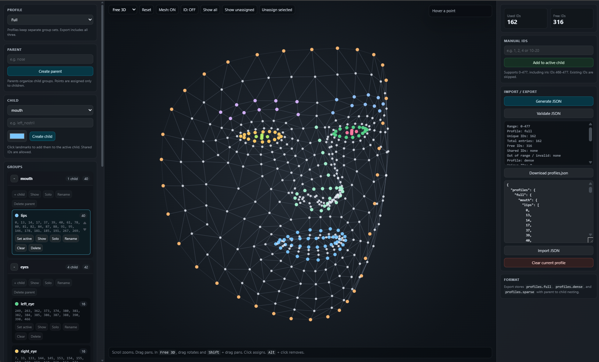

# Nuke Face Tracker

AI-assisted face tracking toolkit for Foundry Nuke. The plugin uses Google
MediaPipe Face Landmarker in an isolated Python virtual environment and exports
the result as native Nuke nodes: `Tracker4`, `Roto`, and `CornerPin2D`.

The MediaPipe backend is executed in a separate subprocess, outside Nuke's own
Python runtime. This keeps third-party binary libraries such as MediaPipe,
OpenCV, Protobuf, and NumPy away from Nuke's process and avoids the common C++
library conflicts that can crash the host application.

---

## Features

- **Isolated backend** - MediaPipe runs from the local `.venv` in a subprocess,
  while Nuke only drives the UI and node creation.
- **Video and image sequence input** - Supports common video files and Nuke-style
  image sequences such as `####`, `%04d`, PNG, JPG, and EXR. High bit depth
  frames are normalized for MediaPipe processing.
- **Pipeline-aware source detection** - The FaceTracker group follows upstream
  inputs to find the active Read-like source, including primary inputs and
  selected Switch/Dissolve branches.
- **Tracking quality controls** - Choose video or frame-by-frame tracking,
  confidence presets, optional backward pass averaging, and optional
  SmartVector refinement.
- **Mapping-driven exports** - Tracker, Roto, and GridWarp exports use the
  bundled `default_mapping.json`, or a custom profile JSON exported from the
  landmark grouping tool.
- **Tracker export** - Generates a native `Tracker4` node from sparse, dense,
  or full landmark profile sets.
- **Roto export** - Generates animated Roto splines for selected facial
  contours, with optional cusped or smooth Bezier shapes.
- **CornerPin export** - Builds a `CornerPin2D` node from the tracked facial
  bounding region and a chosen reference frame.
- **GridWarp export** - Builds a reference-frame face grid from the mapping and
  animates the source grid from tracked landmarks.
- **Landmark grouping tool** - Includes a browser-based MediaPipe landmark
  grouper for designing and validating parent/child landmark mappings.

---

## Installation

### 1. Get the Plugin Files

Clone this repository:

```bat
git clone https://github.com/SykkoAtHome/NukeFaceTracker.git
```

Or download the repository as a ZIP from GitHub and extract it anywhere on your
machine. The extracted or cloned `NukeFaceTracker` folder is the plugin folder.

### 2. Install Backend Dependencies

From the plugin folder, run:

```bat
install_requirements.bat
```

The installer:

1. Creates a local `.venv/` virtual environment.
2. Installs the backend packages from `requirements.txt`.
3. Downloads the MediaPipe `face_landmarker.task` model into `backend/`.

### 3. Register the Plugin in Nuke

Add the path to your cloned or extracted `NukeFaceTracker` folder to your user
`.nuke/init.py`.

```python
nuke.pluginAddPath("/path/to/NukeFaceTracker")
```

Replace `/path/to/NukeFaceTracker` with the real folder path on your machine. Use
forward slashes in the path, including on Windows. For example, if you cloned or
extracted the repo to `C:\Tools\NukeFaceTracker`, use:

```python
nuke.pluginAddPath("C:/Tools/NukeFaceTracker")
```

On Nuke startup, this repo's `init.py` adds `frontend/` and `backend/` to the
plugin and Python paths, and `menu.py` registers the node in the Nodes toolbar.

---

## Nuke Workflow



1. Open Foundry Nuke.
2. Create or select the image pipeline you want to track.
3. Create the node from **Nodes toolbar -> Face Tracker -> Face Tracker**.
4. Connect the FaceTracker input to the source image stream.
5. In the **Analyze Face** tab:
   - Set the frame range, or use **Set to Input Range**.
   - Choose **Video** for temporally stabilized tracking or **Image** for
     independent frame-by-frame detection.
   - Pick the quality preset.
   - Enable **Backtrack** if you want forward/backward passes averaged together.
   - Enable **Refine with SmartVectors** when a SmartVector pass is connected to
     the second input.
   - Click **Track Face**.
6. Optional: in the **Settings** tab, point **Mapping JSON** at a custom profile
   file exported from the landmark grouper.
7. Export the result from one of the output tabs:
   - **Tracker** creates a `Tracker4` node.
   - **Roto** creates animated contour splines.
   - **CornerPin** creates a `CornerPin2D` node from the tracked face bounds.
   - **GridWarp** creates a mapped face grid using a reference frame.

Tracking data is written to Nuke's temp directory by default. Enable **Write
Results to File** in the FaceTracker node if you want to keep the generated JSON
at a specific path.

If MediaPipe does not detect a face on a frame, the backend leaves that frame
unkeyed. Exports preserve those gaps instead of synthesizing keyframes, allowing
Nuke's native curve interpolation to solve between detected frames.

---

## Export Options

### Tracker



The Tracker tab filters the analyzed landmark data at export time. You can
change these options after analysis without rerunning MediaPipe.

- **Landmark Density**
  - `Sparse (Standard)` - named points such as nose tip, eye corners, mouth
    corners, cheeks, chin, and forehead.
  - `Dense (Feature Contours)` - ordered feature contours for eyes, brows, lips,
    nose, iris, and face oval.
  - `Full` - the authored full profile from the active mapping JSON.
- **Select Landmarks to Track** limits export by face part: Nose, Eyes,
  Eyebrows, Mouth, and Face Shape.
- **Export Transform Flags** controls the `T`, `R`, and `S` flags on the
  generated Tracker4 tracks.
- **Corner Pin** adds four calculated face bounding-box tracks to the Tracker4
  export.

### Roto



The Roto tab exports spline-friendly contour groups such as face oval, lips,
eyes, iris, eyebrows, nose bridge, and nostrils. Surface and full mesh point
clouds are intentionally not exported as Roto shapes.

### CornerPin



The CornerPin tab creates an animated `CornerPin2D` node. The `to` corners are
taken from the selected reference frame, while the `from` corners are animated
from the tracked facial bounding region.

### GridWarp

The GridWarp tab uses the active mapping's `grid` profile. The selected
reference frame defines the static destination grid, and the source grid payload
is animated from tracked `grid_rXX_cYY` landmark tracks.

---

## Landmark Grouper

The repo includes a standalone helper at
`tools/mediapipe_landmark_grouper.html` for building and validating MediaPipe
landmark group mappings.



Use it in a browser to:

- View MediaPipe FaceMesh points in front, side, top, or free 3D view.
- Create parent groups such as `nose`, `eyes`, or `mouth`.
- Create child groups such as `left_nostril`, `left_iris`, or `lips_outer`.
- Assign points by clicking landmarks or by entering manual ID ranges.
- Import and export profile-based nested JSON mappings.
- Validate duplicate, invalid, and unassigned IDs across the 0-477 range,
  including iris IDs.

The tool exports all mapping profiles together. Each profile contains the
parent -> child group structure:

```json
{
  "profiles": {
    "full": {
      "nose": {
        "left_nostril": [458, 250, 290],
        "right_nostril": [75, 60, 20]
      }
    },
    "dense": {
      "nose": {
        "left_nostril": [458, 250],
        "right_nostril": [75, 60]
      }
    },
    "sparse": {
      "nose": {
        "left_nostril": [458],
        "right_nostril": [75]
      }
    }
  }
}
```

For compatibility, importing a plain parent -> child mapping still loads it
into the currently selected profile.

---

## Project Layout

- `init.py` - Registers `frontend/` and `backend/` paths for Nuke.
- `menu.py` - Adds the Face Tracker node to Nuke's Nodes toolbar.
- `install_requirements.bat` - Creates `.venv`, installs dependencies, and
  downloads the MediaPipe model.
- `requirements.txt` - Backend Python dependencies.
- `default_mapping.json` - Bundled landmark profiles used by the Nuke plugin.
- `backend/`
  - `tracker_backend.py` - CLI tracking backend, frame loading, MediaPipe
    inference, coordinate conversion, and JSON output.
  - `landmarks_config.py` - Landmark groups, contour definitions, density
    resolvers, and Roto contour specs.
  - `model_downloader.py` - Downloads `face_landmarker.task`.
- `frontend/`
  - `nuke_tracker.py` - FaceTracker group creation, Nuke knobs, subprocess
    execution, SmartVector refinement, and native node exporters.
- `tools/`
  - `mediapipe_landmark_grouper.html` - Browser landmark grouping utility.
- `imgs/`
  - `analyze_face.png` - FaceTracker Analyze Face tab screenshot.
  - `export_tracker.png` - Tracker export tab screenshot.
  - `export_roto.png` - Roto export tab screenshot.
  - `export_corner_pin.png` - CornerPin export tab screenshot.
  - `landmark_grouper.png` - Screenshot used by this README.
- `tests/` - Pytest coverage for tracker behavior and refinement helpers.

---

## Technical Notes

MediaPipe outputs normalized image coordinates with `(0, 0)` at the top-left.
Nuke expects pixel coordinates in its bottom-left-origin image space. The backend
converts every tracked point before serialization:

```text
X_Nuke = X_MediaPipe * Width
Y_Nuke = Height - (Y_MediaPipe * Height)
```

For video mode, backend timestamps are generated from the processed frame index
instead of absolute timeline frame numbers. This keeps MediaPipe timestamps
monotonic even on negative or non-zero VFX frame ranges.

---

## Development

Run tests with:

```bat
pytest
```

The test suite is designed to run outside Nuke by stubbing Nuke-specific pieces
where possible.
